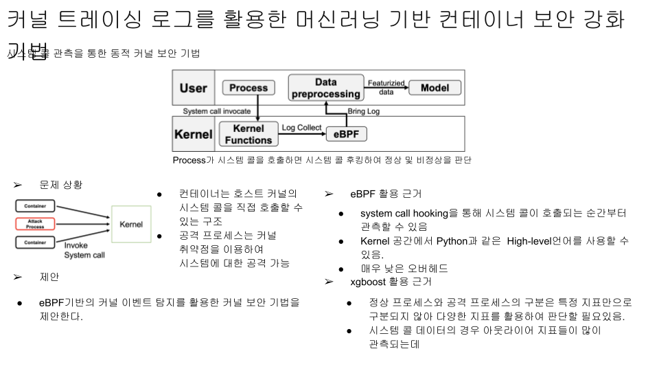

# 🛡️ Kernel Attack Detect (eBPF & ML 기반 커널 공격 탐지)

[커널 트레이싱 로그를 활용한 머신러닝 기반 컨테이너 보안 강화 기법 프로잭트 상세 ](https://docs.google.com/presentation/d/1OcX_0PfqPiolaT3oqVoi-7p22OAEYcIA4ZTJd8RHTBs/edit?usp=sharing)